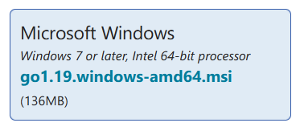

# Go语言的环境安装

## 安装Go

### 1. 下载

> [点击此处进入下载页面](https://go.dev/dl/)
> 在 ↑ 下载页面中，点击：
> 

### 2. 安装

（略）

### 3. 测试

打开命令行，比如 PowerShell 或者 CMD，运行：

```shell
go
```

如果显示

```
Go is a tool for managing Go source code.

Usage:

        go <command> [arguments]

The commands are:
...
```

则说明安装成功。

## 安装 vscode

（略）

## 配置 vscode

### 1. 安装扩展

打开 vscode，点击扩展，搜索 `go` 。


### 2. 安装扩展的扩展

按下 `F1` 键，输入 `Go: Install/Update Tools`。
然后全选，点击安装。

> 如果失败了的话，需要挂梯子
> 运行：
> 
> ```shell
> go env -w GO111MODULE=on
> go env -w GOPROXY=https://goproxy.cn,direct
> ```
> 
> 重启 vscode 之后，再重试 `Go: Install/Update Tools`。

-----

当显示下面信息之后，就表示安装成功了。

```
All tools successfully installed. You are ready to Go. :)
```