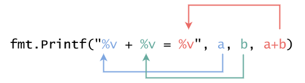

# Go 语言中的基本运算和输入输出

前言：不知道鸽了几周，突然又想起来，好像自己还在学 Go，那就继续吧。

## 变量和常量

* 变量 - 指在程序运行过程中，可以被重复赋值的可以变更的代数符号，用`var`来标注。
* 常量 - 指被赋值过一次之后，就不可变更的代数符号，用`const`来标注。

```go
const PI = 3.1415
var r = 5

// 也可以用括号统一声明多个变量
var (
    a = 1
    b = 2
)
```

### 变量赋值

变量的值随时可以通过`变量名 = 新值`进行重新赋值，而且声明变量的时候，可以不带初始值，但是这种情况必须带有变量的类型

```go
var a int
var (
    b, c int
)

// 定义后再初始化
a = 1
b = 2
c = a + b

// 重新赋值
b = 5
a = b + c
```

## 基本运算符

* `+` - 加法运算。
* `-` - 减法运算。
* `*` - 乘法运算。
* `/` - 除法运算。（如果是两个整型变量运算的话，结果也是整型，即完全舍去小数部分）
* `%` - 取余运算。

### 赋值运算（自运算）

```go
a = a + 2
```

当我们要进行上面的操作的时候，可以简写成`a += 2`，是等效的，上面的五个基本运算符都可以这样进行简写。

```go
a = a + 1
a = a - 1
```

当运算为`+`或者`-`的时候，并且自加/自减的数值是`1`的时候，还可以进一步简写为`a++`或者`a--`。

## 输入输出

### `fmt.Print` 和 `fmt.Println` 的区别

两个函数都是输出到 `stdout`（标准输出流，一般控制台程序就是控制台窗口）。
其中`fmt.Print`是普通输出函数，`fmt.Println`在输出之后同时会自动附加一个换行符。

例：
```go
fmt.Print("Hello,")
fmt.Print("world")
// 输出： 
// Hello,world

fmt.Println("Hello,")
fmt.Println("world")
// 输出：
// Hello,
// world
//
```

> 注：`Print`和`Println`函数也可以接收多个参数，如果在`Println`中使用多个参数的话，仅在最后一个输出之后会附加换行符。
> 例：
> ```go
> fmt.Println("Hello,", "world")
> // 输出：
> // Hello,world
> //
> ```

### 格式化输出`fmt.Printf`

一般格式是：`fmt.Printf("字符串模板", 变量1, 变量2, 变量3)`
其中，`字符串模板`里面，会含有一部分的`%v`这样的占位符，后面的`变量n`会按照顺序替换`字符串模板`里面的占位符。



假设此时`a`的值是`1`，`b`的值是`2`，那么输出就会是`1 + 2 = 3`。

程序会在运行的时候，对`a`, `b`, `a+b`进行取值，然后写入到前面的模板中。

#### 字符串模板中的宽度指定

`%v`还可以写成`%数字v`的形式，数字可以是正数或者负数。如果是正数，就在左侧加空格，如果是负数就在右侧加空格，使得最后输出的文本长度跟指定的数字相同。

```go
fmt.Printf("123456789\n")
fmt.Printf("%4v|\n", 6)
fmt.Printf("%-4v|\n", 6)
// \n 是换行符
// 输出：
// 123456789
//    6|
// 6   |
```

> 提问：如果指定的数字比实际数值要短，会怎样？
> 例如：`fmt.Printf("%4v|\n", 12345)`
> 回答：输出：`12345|`，指定长度的填充只有在不足长度的时候会生效，如果超过了的话，就会无视他。

#### 扩展阅读：其他占位符

字符串模板中可以指定的占位符不止`%v`，还有很多很多。有兴趣的话可以读一读[02ex1.其他占位符](./02ex1.其他占位符.md)。


## 小课题：猜数游戏

> （这个课题，放这里并不合适，找个机会挪走他）

让计算机程序生成一个随机数字，然后存在变量里面。
从键盘读取你输入的数字，跟变量进行对比。
如果大了就输出`大了`,如果小了，就输出`小了`。
如果猜中了，就输出`Bingo`，并且结束程序。

