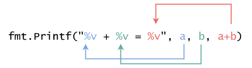

# Go 语言中的基本运算和输入输出

前言：不知道鸽了几周，突然又想起来，好像自己还在学 Go，那就继续吧。

## 基本运算符

* `+` - 加法运算。
* `-` - 减法运算。
* `*` - 乘法运算。
* `/` - 除法运算。（如果是两个整型变量运算的话，结果也是整型，即完全舍去小数部分）
* `%` - 取余运算。

### 小数运算

当整数除以整数，最后得到的仍然是整数，小数部分会被丢弃掉。

```go
var a = 4
var b = 5
fmt.Println(a / b)
// 输出： 0
```

必须将两个变量都改为带小数的数值才能保留小数部分，我们称这种带小数的数值叫做浮点数。

```go
var a = 4.0
var b = 5.0
fmt.Println(a / b)
// 输出: 0.8
```

> `a`和`b`必须同为浮点数才可以进行运算，如果用下面的代码则会报错
> ```go
> var a = 4
> var b = 5.0
> fmt.Println(a / b)
> // invalid operation: a / b (mismatched types int and float64) (exit status 2)
> ```

> `a`不能被`b`整除，会保留一定位数的小数，直接截断，最后一位小数不会四舍五入。

#### 精度丢失

```go
var a = 0.1
a += 0.2
fmt.Println(a)
```

最后输出的结果是`0.300000000000004`，由于浮点数会转换成二进制小数存放在内存里面，这导致除不尽的二进制小数会丢失精度，导致最后运算的结果会有误差。
基于这一点，通常来说，浮点数不适合用于金融系统的运算。
为了最小化误差，建议先乘后除。

### 赋值运算（自运算）

```go
a = a + 2
```

当我们要进行上面的操作的时候，可以简写成`a += 2`，是等效的，上面的五个基本运算符都可以这样进行简写。

```go
a = a + 1
a = a - 1
```

当运算为`+`或者`-`的时候，并且自加/自减的数值是`1`的时候，还可以进一步简写为`a++`或者`a--`。

## 输入输出

### `fmt.Print` 和 `fmt.Println` 的区别

两个函数都是输出到 `stdout`（标准输出流，一般控制台程序就是控制台窗口）。
其中`fmt.Print`是普通输出函数，`fmt.Println`在输出之后同时会自动附加一个换行符。

例：
```go
fmt.Print("Hello,")
fmt.Print("world")
// 输出： 
// Hello,world

fmt.Println("Hello,")
fmt.Println("world")
// 输出：
// Hello,
// world
//
```

> 注：`Print`和`Println`函数也可以接收多个参数，如果在`Println`中使用多个参数的话，仅在最后一个输出之后会附加换行符。
> 例：
> ```go
> fmt.Println("Hello,", "world")
> // 输出：
> // Hello,world
> //
> ```

### 格式化输出`fmt.Printf`

一般格式是：`fmt.Printf("字符串模板", 变量1, 变量2, 变量3)`
其中，`字符串模板`里面，会含有一部分的`%v`这样的占位符，后面的`变量n`会按照顺序替换`字符串模板`里面的占位符。



假设此时`a`的值是`1`，`b`的值是`2`，那么输出就会是`1 + 2 = 3`。

程序会在运行的时候，对`a`, `b`, `a+b`进行取值，然后写入到前面的模板中。

#### 字符串模板中的宽度指定

`%v`还可以写成`%数字v`的形式，数字可以是正数或者负数。如果是正数，就在左侧加空格，如果是负数就在右侧加空格，使得最后输出的文本长度跟指定的数字相同。

```go
fmt.Printf("123456789\n")
fmt.Printf("%4v|\n", 6)
fmt.Printf("%-4v|\n", 6)
// \n 是换行符
// 输出：
// 123456789
//    6|
// 6   |
```

> 提问：如果指定的数字比实际数值要短，会怎样？
> 例如：`fmt.Printf("%4v|\n", 12345)`
> 回答：输出：`12345|`，指定长度的填充只有在不足长度的时候会生效，如果超过了的话，就会无视他。


#### 字符串模板中的小数位数指定

如果想要输出浮点数的话，可以写成`%n.mf`的形式，`n`表示总体宽度，具体跟上一节一样。`m`是小数位数。
如果不想指定宽度，可以省略`n`不写，即：`%.mf`。

#### 扩展阅读：其他占位符

字符串模板中可以指定的占位符不止`%v`，还有很多很多。有兴趣的话可以读一读[02ex1.其他占位符](./02ex1.其他占位符.md)。

### 输入

#### fmt.Scan

```go
fmt.Scan(&a, &b, &c)
```

从控制台中获取输入，每个值自动用空白字符分隔，回车也会被视为空白字符。

#### fmt.Scanln

```go
fmt.Scanln(&a, &b, &c)
```

从控制台中获取一行输入，并自动用空格分隔，再按顺序赋值到参数列表中。

#### 思考

如果输入是：
```
1
2
3
```
使用 `fmt.Scan` 和 `fmt.Scanln` 会有什么不同。
> 如果使用 `fmt.Scanln`，他只会读取第一行，因为遇到回车，他就停止了。
> 最后只有 `1` 被赋值给了 `a`，其他两个变量的值不会发生变化。

#### fmt.Scanf

```go
fmt.Scanf("a=%d,b=%d", &a, &b)
```
从控制台中获取输入，并按照设定好的格式进行获取，如果不按照指定格式，则会失败。

#### 思考

按照上面的格式，如果输入以下内容会怎么样：
```go
a=1,b=2
a=1,c=2
b=1,a=2
c=1,b=2
```

> * `a=1,b=2` 的情况：
> 由于是正确的格式，最后 `1` 会赋值给 `a`，`2` 会赋值给 `b`。
>
> * `a=1,c=2` 的情况：
> 由于到 `a=%d,` 为止，格式都是正确的，所以 `1` 会赋值给 `a`，但是后面的格式不对了，所以读取会失败。
>
> * `b=1,a=2`, `c=1,b=2` 的情况：
> 由于从最开始的时候，格式就是错误的，所以整个读取都会失败。

